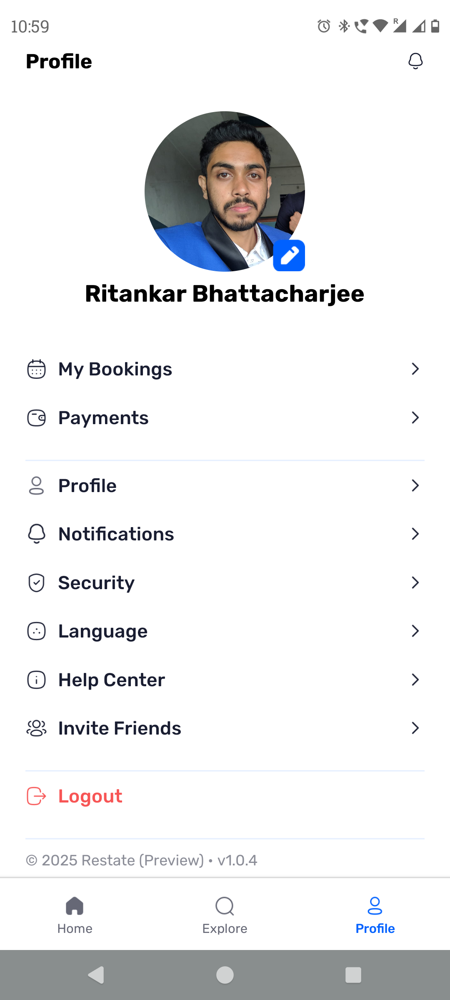

# Real Estate App

A modern real estate mobile application built with Expo React Native, showcasing property search, filtering capabilities, and secure user authentication.

## 📱 About This Project

This is a **portfolio project** demonstrating full-stack mobile development skills with modern technologies and best practices. The app provides a complete real estate browsing experience with intuitive user interface and robust backend integration.

## ✨ Key Features

- **OAuth Authentication**: Secure user login and registration system
- **Property Search**: Comprehensive property browsing with search functionality
- **Advanced Filtering**: Filter properties by area, price, type, and other criteria
- **Responsive UI**: Clean, modern interface optimized for mobile devices
- **Real-time Data**: Dynamic property listings with live updates

## 🛠️ Technology Stack

**Frontend**

- Expo React Native
- TypeScript
- React Native Components

**Authentication**

- Clerk (OAuth Integration)

**Backend & Database**

- Convex (Real-time backend)

## 🎯 Core Functionality

**User Authentication**

- OAuth login/registration
- Secure session management
- User profile handling

**Property Management**

- Browse property listings
- Search with multiple parameters
- Filter by various criteria
- View detailed property information

**User Experience**

- Intuitive navigation
- Smooth animations and transitions
- Responsive layout design
- Loading states and error handling

## 📱 App Highlights

This application demonstrates proficiency in:

- Modern React Native development patterns
- Third-party service integration (Clerk, Convex)
- Mobile UX/UI best practices
- Real-time data synchronization
- Secure authentication implementation

---

**Portfolio Project** - Built to showcase full-stack mobile development capabilities using cutting-edge technologies.
